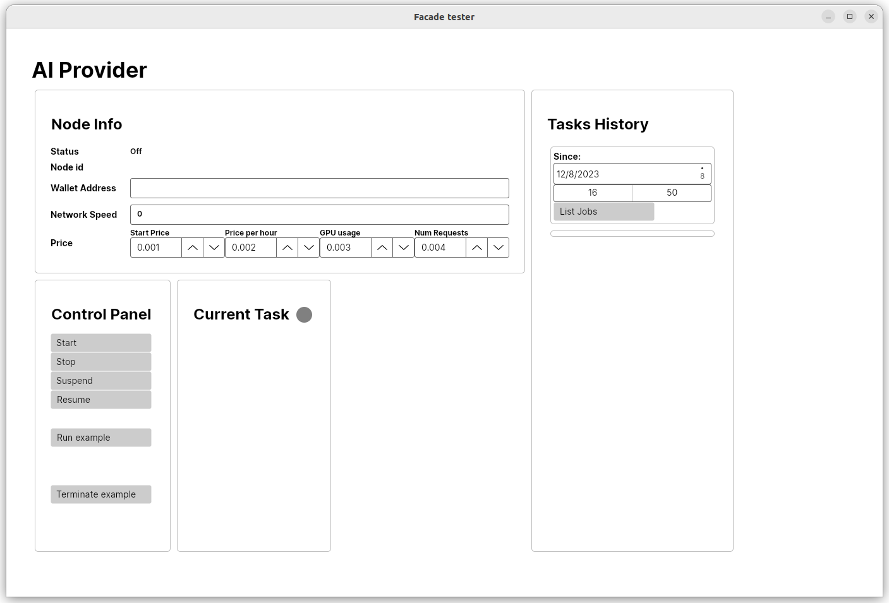
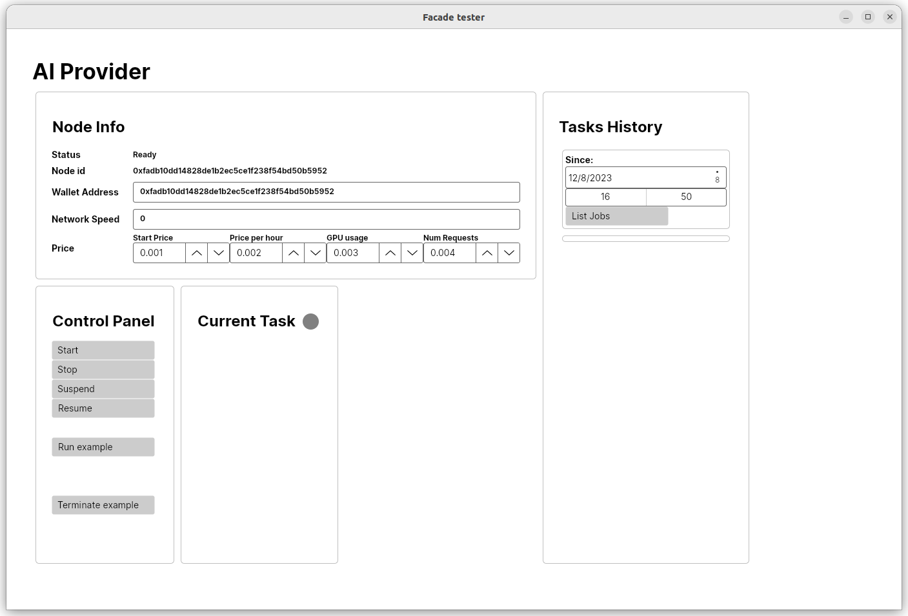
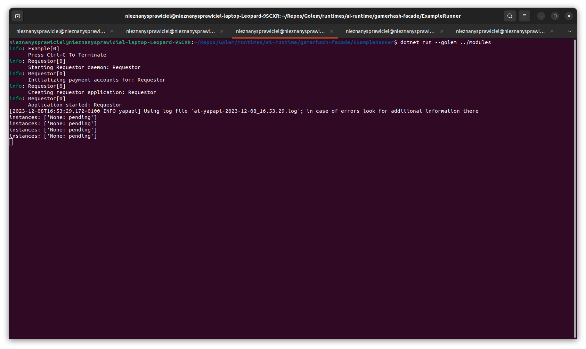
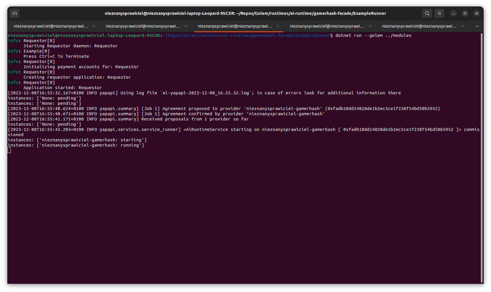
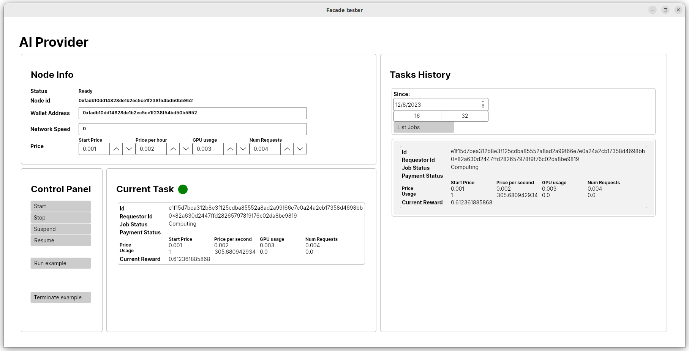
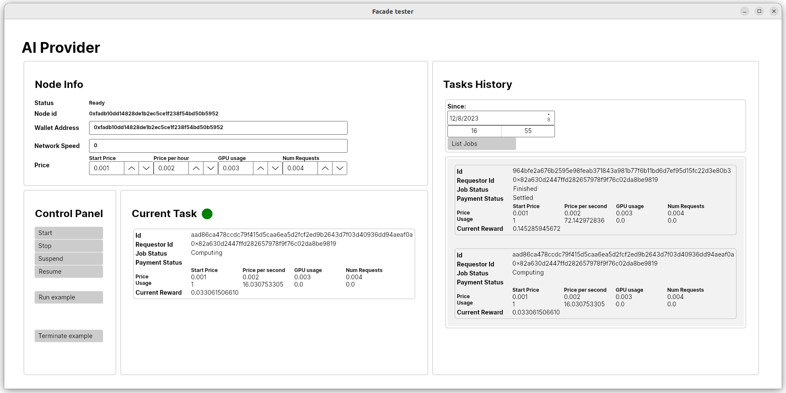

# Facade usage instruction

## Quick start

Inside `gamerhash-facade` project directory run in command line:
```
dotnet run --project Golem.Package -- download --target modules
dotnet run --project MockGUI --golem modules --use-dll
dotnet run --project ExampleRunner -- --golem modules --framework Dummy
```

In `MockGUI` click Start button to run Golem and wait for tasks.

## Application flow description

First we need to create directory structure for `MockGUI`. Detailed description of possible options can be found [here](MockGUI/readme.md#preparing-directories).

`Golem.Package` project is able to download all necessary binaries and create directory structure for Golem. Result of running `dotnet run --project Golem.Package -- download --target modules` will look like this:
```
nieznanysprawiciel@nieznanysprawiciel-laptop-Leopard-9SCXR:~/Repos/clones/gamerhash-facade$ tree .
.
├── modules
│   ├── golem
│   │   ├── Golem.dll
│   │   ├── GolemLib.dll
│   │   ├── yagna.exe
│   │   └── ya-provider.exe
│   └── plugins
│       ├── dummy.exe
│       ├── ya-dummy-ai.json
│       └── ya-runtime-ai.exe
└── Readme.md
```

### Facade GUI

Although facade is meant to be used as library for applications serving resources using Golem Provider, the best starting point is to use `MockGUI` to check how facade works. `MockGUI` can be understood as browser GUI to API exposed by facade.

After starting `MockGUI` we will see screen like this:


Golem is not running by default. Facade expects developer to explicite start it in code. After clicking `Start` button and waiting for initialization to finish we will see basic Golem properties displayed:



### Running example tasks

`ExampleRunner` is application created to send mock AI tasks to the network which can be presented by facade.
Run `dotnet run --project ExampleRunner --golem modules` and wait until Golem will pick up task.



After few seconds `ExampleRunner` should find Provider and will start displaying running service:



On `MockGUI` side it will look like this:



Since task doesn't do anything meaningful it can run indefinitely.
Hit Ctrl-C in `ExampleRunner` to finish task and accept payments.
Gracefully shutdown application should take a few seconds to stop python script and yagna daemon:


You can hit Ctrl-C for the second time to forcefully kill application.

#### Running example tasks on Mainnnet

Requestor's mainnet key is using [git-crypt](https://github.com/AGWA/git-crypt).

Before running tasks on mainnet decrypt the key: `git-crypt unlock`

Run both _MockGUI_ and _ExampleRunner_ with `--mainnet` param.

```ps1
dotnet run --project MockGUI --golem modules --mainnet
dotnet run --project ExampleRunner -- --golem modules --framework Dummy --mainnet
```

##### Adding new users to git-crypt

Download user's public key.

```sh
# Import it (it will print its id (later it can be done with `gpg --list-keys`))
gpg --import user_pubkey.gpg
# Add new user using printed ID (It creates a commit. Use --no-commit when adding multiple users)
git-crypt add-gpg-user --trusted ABC123XYZ
```

### Statuses of finished jobs

Although Requestor should accept Invoices immediately or short time after task was finished, the payments aren't done immediately. Payment driver can batch payments together to avoid paying higher gas fees.

For this reason Payment Status won't be displayed, when the job is finished. To check how the status changes you can click `List Jobs` button to display history of computed jobs.



> [!NOTE]  
> Current imlementation of `List Jobs` displays only tasks computed during current session of `MockGUI` application.
> This is temporary behavior which will be reimplemented according to specification later.

## Troublshooting

### Provider doesn't pick up tasks

Sometimes after starting `ExampleRunner` script, it can last pretty long until Provider will pick up task.
The reason for this could be Offers propagation in the network. In larger network Offers propagation lasts
longer than in smaller network, since they are propagated only to closest neighborhood and repropagated by other Nodes.
This doesn't cause problems in normal network conditions, when we have many Providers, but is problematic in
test setup, when we want to match specific single Provider with specific Requestor.

To workaround this problem you can use smaller network, by switching to `devnet` relay server:

```
dotnet run --project MockGUI --golem modules --use-dll --relay Devnet
dotnet run --project ExampleRunner --golem modules --relay Devnet
```

> [!NOTE] `MockGUI` should be ran first, because it setups local server.

If this is not enough you can use local relay setup, by running:

```
dotnet run --project MockGUI -- --golem modules --use-dll --relay Local
dotnet run --project ExampleRunner -- --golem modules --framework Dummy --relay Local
```

### Other Providers stealing your jobs

If many people are testing facade at the same time, it can happen that other Providers will steal jobs from your `ExampleRunner`.
If it interferes with your testing than switch to `--relay Local`.

## Package with Automatic

To create Golem Package with Automatic runtime run:

```ps1
dotnet publish --configuration Release
dotnet run --project Golem.Package --configuration Release build --dont-clean --dll-file-patterns "*.dll" --dll-dir "$(Get-Location)\Golem\bin\Release\net7.0\publish"
# use `-cleanup 0` to avoid downloading and unpacking again `bin\automatic_runtime_package.zip` archive
# use `-compress 0` to skip archiving `package` dir into `bin\dist_package.zip`
 .\scripts\automatic.ps1 -compress 1 -cleanup 1
```

Release package is stored in `bin\dist_package.zip`.

Unpacked content of the archive (including Automatic) is stored in `package` directory.
