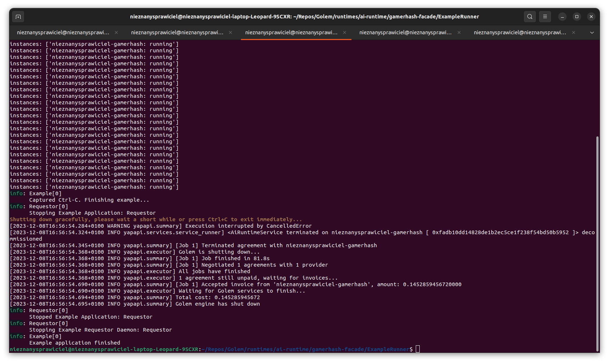

# Facade usage instruction

## Quick start

Inside `gamerhash-facade` project directory run in command line:
```
dotnet run --project Golem.Package -- download --target modules
dotnet run --project MockGUI --golem modules --use-dll
dotnet run --project ExampleRunner --golem modules
```

In `MockGUI` click Start button to run Golem and wait for tasks.

## Application flow description

First we need to create directory structure for `MockGUI`. Detailed description of possible options can be found [here](MockGUI/readme.md#preparing-directories).

`Golem.Package` project is able to download all necessary binaries and create directory structure for Golem. Result of running `dotnet run --project Golem.Package -- download --target modules` will look like this:
```
nieznanysprawiciel@nieznanysprawiciel-laptop-Leopard-9SCXR:~/Repos/clones/gamerhash-facade$ tree .
.
├── modules
│   ├── golem
│   │   ├── Golem.dll
│   │   ├── GolemLib.dll
│   │   ├── yagna.exe
│   │   └── ya-provider.exe
│   └── plugins
│       ├── dummy.exe
│       ├── ya-dummy-ai.json
│       └── ya-runtime-ai.exe
└── Readme.md
```

### Facade GUI

Although facade is meant to be used as library for applications serving resources using Golem Provider, the best starting point is to use `MockGUI` to check how facade works. `MockGUI` can be understood as browser GUI to API exposed by facade.

After starting `MockGUI` we will see screen like this:


Golem is not running by default. Facade expects developer to explicite start it in code. After clicking `Start` button and waiting for initialization to finish we will see basic Golem properties displayed:


### Running example tasks

`ExampleRunner` is application created to send mock AI tasks to the network which can be presented by facade.
Run `dotnet run --project ExampleRunner --golem modules` and wait until Golem will pick up task.


After few seconds `ExampleRunner` should find Provider and will start displaying running service:


On `MockGUI` side it will look like this:


Since task doesn't do anything meaningful it can run indefinitely.
Hit Ctrl-C in `ExampleRunner` to finish task and accept payments.
Gracefully shutdown application should take a few seconds to stop python script and yagna daemon:



You can hit Ctrl-C for the second time to forcefully kill application.

### Statuses of finished jobs

Although Requestor should accept Invoices immediately or short time after task was finished, the payments aren't done immediately. Payment driver can batch payments together to avoid paying higher gas fees.

For this reason Payment Status won't be displayed, when the job is finished. To check how the status changes you can click `List Jobs` button to display history of computed jobs.


> [!NOTE]  
> Current imlementation of `List Jobs` displays only tasks computed during current session of `MockGUI` application.
> This is temporary behavior which will be reimplemented according to specification later.
